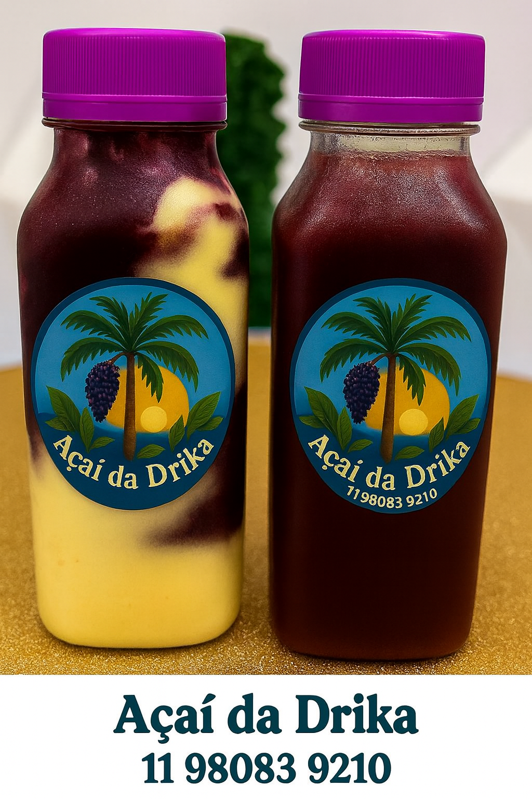
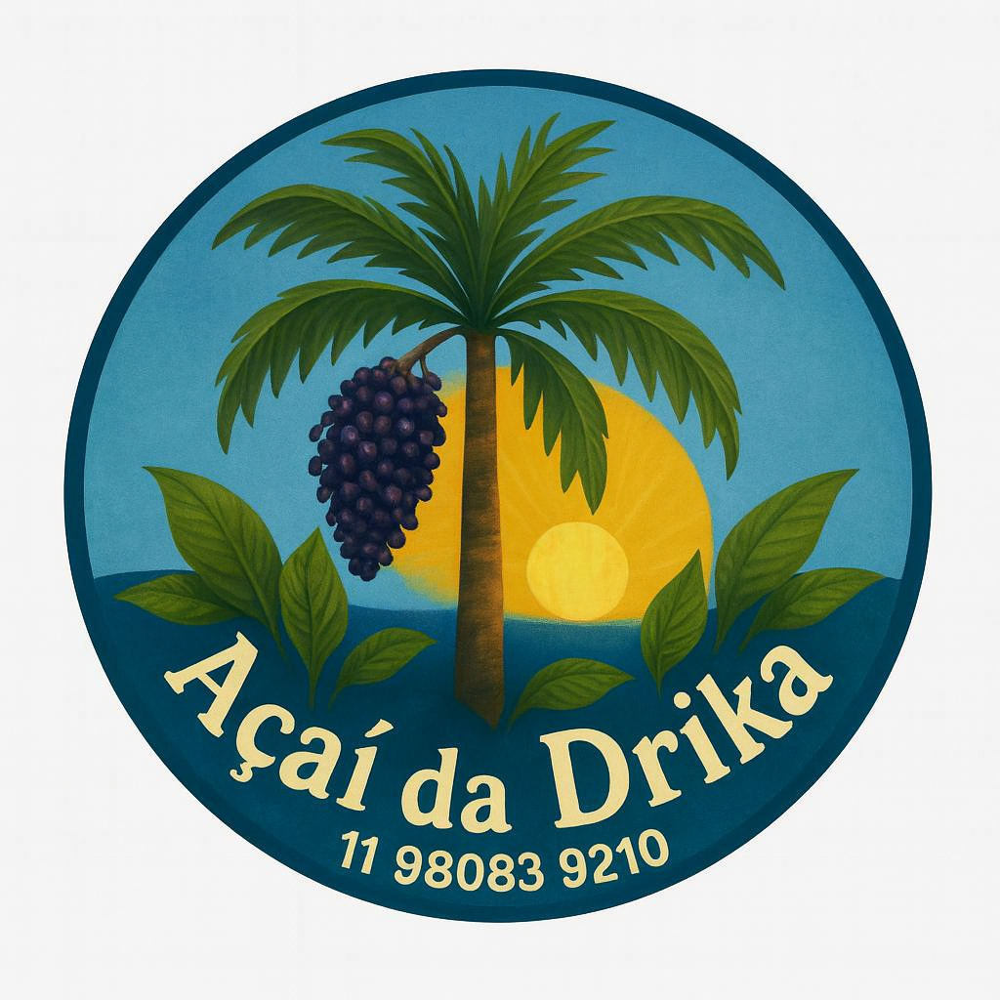

/* ===================== ESTILO DO CARROSSEL DRIKA ===================== */
/* Este módulo estiliza o carrossel editorial de imagens de açaí */

/* Fundo suave do carrossel com gradiente pastel */
.fundo-carrossel {
  position: absolute; /* Posiciona atrás dos elementos principais */
  top: 0;
  left: 0;
  width: 100%; /* Ocupa toda a largura */
  height: 100%; /* Ocupa toda a altura */
  background: linear-gradient(to bottom right, #c68ff0, #749be3); /* Gradiente suave */
  opacity: 0.3; /* Transparência para não competir com o conteúdo */
  z-index: 0; /* Fica atrás dos demais elementos */
}

/* Container principal do carrossel */
.carrossel-container {
  position: relative; /* Permite posicionamento dos botões e fundo */
  display: flex; /* Alinha itens em linha */
  align-items: center; /* Centraliza verticalmente */
  justify-content: center; /* Centraliza horizontalmente */
  overflow: hidden; /* Esconde conteúdo que ultrapassa os limites */
  padding: 1rem 3rem; /* Espaçamento interno */
  background-color: rgba(255, 255, 255, 0.50); /* leve transparência */
  box-shadow: 0 0 20px rgba(0,0,0,0.1); /* Sombra leve para profundidade */
  z-index: 2; /* Garante que fique acima do fundo */

}

/* Área que agrupa os itens do carrossel */
.carrossel-itens {
  display: flex; /* Alinha os artigos em linha */
  gap: 2rem; /* Espaçamento entre os itens */
  transition: transform 0.5s ease, height 0.5s ease; /* Suaviza transições de movimento */

}

/* Estilo base de cada item do carrossel */
.carrossel-item {
  min-width: 260px; /* Largura mínima para consistência visual */
  max-width: 260px; /* Largura máxima para evitar distorções */
  flex-shrink: 0; /* Impede que o item encolha */
  text-align: center; /* Centraliza conteúdo interno */
  opacity: 0.5; /* Deixa item não ativo mais apagado */
  transform: scale(0.95); /* Leve redução para destacar o ativo */
  transition: all 0.3s ease; /* Suaviza qualquer mudança de estado */
  display: none; /* Esconde todos os itens por padrão */
  min-height: 420px; /* Mantém altura estável entre itens */
  position: relative; /* Necessário para posicionar as setas dentro do item */
}

/* Estilo aplicado ao item ativo (em destaque) */
.carrossel-item.ativo {
  opacity: 1; /* Totalmente visível */
  transform: scale(1.05); /* Leve aumento para destacar */
  display: block; /* Exibe apenas o item ativo */
}

/* Imagem oficial do carrossel */
.carrossel-img-oficial {
  width: 100%; /* Ocupa toda a largura do item */
  border-radius: 15px; /* Bordas arredondadas para estética suave */
  box-shadow: 0 4px 10px rgba(0,0,0,0.2); /* Sombra para destacar a imagem */
  max-width: 320px; /* Limita largura máxima para evitar estouro */
  height: 100; /* Mantém proporção da imagem */
  margin: 0 auto; /* Centraliza horizontalmente */
}
.carrossel-legenda {
  display: flex;
  align-items: center;
  justify-content: space-between;
  flex-direction: row;
  gap: 1rem;
  padding: 0.5rem 1rem;
  font-size: 1rem;
  color: #5a2d0c;
  font-weight: 500;
  word-break: break-word;
  overflow-wrap: break-word;
  min-height: 4rem;
  background-color: transparent;
  position: relative;
}

.carrossel-legenda span {
  flex: 1;
  text-align: center;
  padding: 0 0.5rem; /* Dá respiro lateral ao texto */
}
/* Estilo para links dentro da legenda */
.carrossel-legenda a {
  color: #6a4fb3; /* Roxo editorial */
  font-weight: 600;
  text-decoration: none;
  padding: 0.1rem 0.2rem; /* Espaço interno para não ficar colado */
  border-radius: 4px;
  transition: background-color 0.3s ease;
}

.carrossel-legenda a:hover {
  background-color: #f3e5ff; /* Fundo suave ao passar o mouse */
}
/*setas de navegação*/
.legenda-conteudo {
  display: flex;
  flex-direction: column;
  align-items: center;
  justify-content: center;
  flex: 1;
  gap: 0.3rem;
  text-align: center;
}

.seta-esquerda,
.seta-direita {
  background-color: transparent;
  color: rgba(103, 4, 202, 0.6);
  border: none;
  font-size: 1.4rem;
  padding: 0.2rem 0.4rem;
  cursor: pointer;
  transition: color 0.3s ease;
}

.seta-esquerda:hover,
.seta-direita:hover {
  color: rgba(122, 12, 177, 0.8);
}

.seta-esquerda {
  left: 0.5rem; /* Dentro da área visível */
}

.seta-direita {
  right: 0.5rem;
}

/* ===================== MEDIA QUERIES: RESPONSIVIDADE DO CARROSSEL ===================== */

/* iPhone 8 e telas muito pequenas */
@media screen and (max-width: 380px) {
  .carrossel-item {
    max-width: 220px; /* Reduz largura do item */
  }

  .carrossel-img-oficial {
    max-width: 220px; /* Reduz imagem */
  }

  .carrossel-legenda {
    font-size: 0.85rem; /* Fonte menor para caber melhor */
    padding: 0.5rem 1.5rem; /* Mantém espaçamento lateral */
    gap: 1rem;
  }

  .seta-esquerda,
  .seta-direita {
    font-size: 1.2rem; /* Setas menores */
    padding: 0.3rem 0.6rem; /* Espaço reduzido */
  }
}

/* Smartphones médios (até 480px) */
@media screen and (max-width: 480px) {
  .carrossel-container {
    padding: 0.8rem; /* Espaço interno ajustado */
  }

  .carrossel-item {
    min-width: 240px;
    max-width: 240px;
  }

  .carrossel-legenda {
    font-size: 0.95rem;
  }
}

/* Phablets (até 600px) */
@media screen and (max-width: 600px) {
  .carrossel-container {
    padding: 1rem;
  }

  .carrossel-item {
    min-width: 250px;
    max-width: 250px;
  }
}

/* Tablets pequenos (até 768px) */
@media screen and (max-width: 768px) {
  .carrossel-container {
    padding: 1.2rem;
  }

  .carrossel-item {
    min-width: 260px;
    max-width: 260px;
  }

  .carrossel-legenda {
    font-size: 1rem;
  }
}

/* Notebooks compactos (até 992px) */
@media screen and (max-width: 992px) {
  .carrossel-container {
    padding: 1.5rem;
  }

  .carrossel-item {
    min-width: 280px;
    max-width: 280px;
  }
}

/* Notebooks médios (até 1200px) */
@media screen and (max-width: 1200px) {
  .carrossel-container {
    padding: 1.8rem;
  }

  .carrossel-item {
    min-width: 300px;
    max-width: 300px;
  }
}

/* Desktops grandes (até 1440px) */
@media screen and (max-width: 1440px) {
  .carrossel-container {
    padding: 2rem;
  }

  .carrossel-item {
    min-width: 320px;
    max-width: 320px;
  }

  .carrossel-legenda {
    font-size: 1.05rem;
  }
}

/* Ultrawides (acima de 1920px) */
@media screen and (min-width: 1921px) {
  .carrossel-container {
    padding: 2.5rem;
    max-width: 1600px; /* Limita largura máxima */
    margin: 0 auto; /* Centraliza o carrossel */
  }

  .carrossel-item {
    min-width: 340px;
    max-width: 340px;
  }

  .carrossel-legenda {
    font-size: 1.1rem;
  }

  .seta-esquerda,
  .seta-direita {
    font-size: 2.2rem;
    padding: 0.6rem 1.2rem;
  }
}
/*.carrossel_drika {
  outline: 2px dashed green;  Contorno verde 
}

.carrossel-container {
  outline: 2px dashed red;  Contorno vermelho 
}

.carrossel-item.ativo {
  outline: 2px dashed purple; Contorno roxo para o item ativo
}*/
<!-- Deus, tu és lindo e pertenço somente a Ti -->

<!DOCTYPE html>
<html lang="pt-BR">
<head>
  <meta charset="UTF-8">

  <meta name="viewport" content="width=device-width, initial-scale=1.0">

  <title>Açai da Drika</title>

  <link rel="stylesheet" href="drika_front/drika_styles/drika_pai_styles.css">

  <link href="https://fonts.googleapis.com/css2?family=Playfair+Display&display=swap" rel="stylesheet">

  <link rel="stylesheet" href="https://cdnjs.cloudflare.com/ajax/libs/font-awesome/6.5.0/css/all.min.css">

  <link rel="stylesheet" href="drika_front/drika_prints/drika_print.css" media="print">

</head>

<body> 
    
    <header id="banner">
    

        
    

    </header>

    <main class="main-drika">
    <!-- Flexbox pai -->
    

            <!-- ===================== 1/3 DO TOPO: CARROSSEL COM IMAGEM DE FUNDO SUAVE ===================== -->
            <!-- Comentário editorial: esta seção é a primeira impressão visual do site, com imagens de açaí e legendas que contam histórias -->

        <section class="carrossel-drika">
                
                <!-- Fundo visual esfumado aplicado via CSS -->
            

                <!-- Container principal do carrossel -->
            

                    <!-- Botões de navegação (setas) serão inseridos via JS ou diretamente aqui -->
                    

                    <!-- Área que agrupa todos os itens do carrossel -->
                    

                    <!-- ITEM 1 DO CARROSSEL -->
                        <article class="carrossel-item ativo">
                            

                            
                            

                            
                            <figcaption class="carrossel-legenda">
                            <!-- Botão para avançar imagem -->
                                <button class="seta-esquerda" aria-label="Imagem anterior">←</button>
                                Açaí com Banana - Nutella, Leite Ninho, Paçoca e Granola.
                                <!-- Botão para avançar imagem -->
                                <button class="seta-direita" aria-label="Próxima imagem">→</button>
                            </figcaption>
                        </article>

                    <!-- ITEM 2 DO CARROSSEL -->
                        <article class="carrossel-item">
                            

                            
                            

                           
                            <figcaption class="carrossel-legenda">
                                 <!-- Botão para avançar imagem -->
                                <button class="seta-esquerda" aria-label="Imagem anterior">←</button>
                                Açaí com Manga, Nutella,Leite Ninho, Paçoca e Granola.
                                <button class="seta-direita" aria-label="Próxima imagem">→</button>
                            </figcaption>
                             <!-- Botão para avançar imagem -->
                            
                        </article>

                    <!-- ITEM 3 DO CARROSSEL -->
                        <article class="carrossel-item">
                            

                            
                            

                           
                            <figcaption class="carrossel-legenda">
                                 <!-- Botão para avançar imagem -->
                                <button class="seta-esquerda" aria-label="Imagem anterior">←</button>
                                Açaí com Kiwi, Nutella,Leite Ninho, Paçoca e Granola.
                                <!-- Botão para avançar imagem -->
                                <button class="seta-direita" aria-label="Próxima imagem">→</button>
                            </figcaption>
                             
                        </article>

                        <!-- ITEM 4 DO CARROSSEL - Imagem Propaganda -->
                        <article class="carrossel-item">
                            

                            
                            

                            
                            <figcaption class="carrossel-legenda">
                                <!-- Botão para avançar imagem -->
                                <button class="seta-esquerda" aria-label="Imagem anterior">←</button>
                                 

                                    Aqui na LAS nossa missão é defender os trabalhadores com excelência, comprometimento e responsabilidade. Venha nos conhecer!
                                    <a href="https://www.instagram.com/advogado_leandro/" target="_blank">Saiba mais</a>
                                

                                <!-- Botão para avançar imagem -->
                                <button class="seta-direita" aria-label="Próxima imagem">→</button>
                            </figcaption>
                             
                        </article>

                        <!-- ITEM 5 DO CARROSSEL -->
                        <article class="carrossel-item">
                            

                            
                            

                            
                            <figcaption class="carrossel-legenda">
                                <!-- Botão para avançar imagem -->
                                <button class="seta-esquerda" aria-label="Imagem anterior">←</button>
                                Açaí com Morango, Nutella, Leite,Ninho, Paçoca e Granola.
                                 <!-- Botão para avançar imagem -->
                                <button class="seta-direita" aria-label="Próxima imagem">→</button>
                            </figcaption>
                            
                        </article>

                        <!-- ITEM 6 DO CARROSSEL -->
                        <article class="carrossel-item">
                            

                            
                            

                            
                            <figcaption class="carrossel-legenda">
                                <!-- Botão para avançar imagem -->
                                <button class="seta-esquerda" aria-label="Imagem anterior">←</button>
                                Açaí com duas Frutas, Nutella,Leite Ninho, Paçoca e Granola.
                                <!-- Botão para avançar imagem -->
                                <button class="seta-direita" aria-label="Próxima imagem">→</button>
                            </figcaption>
                             
                        </article>

                        <!-- ITEM 7 DO CARROSSEL Imagem Propaganda-->
                        <article class="carrossel-item">
                            

                                
                            

                            
                            <figcaption class="carrossel-legenda">
                                <!-- Botão para avançar imagem -->
                                <button class="seta-esquerda" aria-label="Imagem anterior">←</button>
                                

                                    Na HopeUp 7.DEV, seu design gráfico e digital ganha vida em sites e impressão. Impulsione seu comércio!
                                    <a href="https://wa.me/5511980839210" target="_blank">Saiba mais</a>
                                

                                 <!-- Botão para avançar imagem -->
                                <button class="seta-direita" aria-label="Próxima imagem">→</button>
                            </figcaption>
                            
                        </article>

                        <!-- ITEM 8 DO CARROSSEL -->
                        <article class="carrossel-item">
                            

                            
                            

                            
                            <figcaption class="carrossel-legenda">
                                <!-- Botão para avançar imagem -->
                                <button class="seta-esquerda" aria-label="Imagem anterior">←</button>
                                Açaí com Sonho de Valsa, Nutella,Leite Ninho, Paçoca e Granola.
                                 <!-- Botão para avançar imagem -->
                                <button class="seta-direita" aria-label="Próxima imagem">→</button>
                            </figcaption>
                            
                        </article>

                        <!-- ITEM 9 DO CARROSSEL -->
                        <article class="carrossel-item">
                            

                            
                            

                            
                            <figcaption class="carrossel-legenda">
                                <!-- Botão para avançar imagem -->
                                <button class="seta-esquerda" aria-label="Imagem anterior">←</button>
                                Açaí no Copo com frutas cuidadosamente cortadas + Nutella,Leite Ninho, Paçoca, Granola.
                                 <!-- Botão para avançar imagem -->
                                <button class="seta-direita" aria-label="Próxima imagem">→</button>
                            </figcaption>
                            
                        </article>

                        <!-- ITEM 10 DO CARROSSEL -->
                        <article class="carrossel-item">
                        

                            
                        

                        
                        <figcaption class="carrossel-legenda">
                            <!-- Botão para avançar imagem -->
                            <button class="seta-esquerda" aria-label="Imagem anterior">←</button>
                            

                                Escolha seu açaí de litro (1L, 1.5L, 2L, 3L) e experimente o mix mais energético da Drika.
                                <a href="https://wa.me/5511980839210" target="_blank">Saiba mais</a>
                            

                             <!-- Botão para avançar imagem -->
                        <button class="seta-direita" aria-label="Próxima imagem">→</button>
                        </figcaption>
                        
                        </article>
                    <!-- Você pode adicionar mais artigos conforme necessário -->
                    

                 

                </section>

        <!-- Bloco institucional: história, foco, sustentabilidade -->
        <section class="institucional-drika">
        

 <!-- imagem de fundo suave e contrastante -->
         <h2>Sobre o Açaí da Drika</h2>
            
Mais do que um açaí delicioso no copo, ou em versões das Garrafinhas de 300ml. 500ml. 1L. 1,5L. 2L. e 3L. <strong>o Açaí da Drika é uma experiência feita com afeto e sabor para todo momento</strong>. Cada pedido é montado com atenção aos detalhes — desde a escolha das frutas até os acompanhamentos que transformam o simples em especial.

            
Você pode escolher entre banana, morango, manga ou kiwi — ou combinar até três frutas. Cada açaí já vem com uma base deliciosa: <strong>uma fruta do seu gosto, Nutella, Leite Ninho, Granola e Leite Condensado.</strong> E se quiser elevar ainda mais o sabor, há acompanhamentos extras como <strong><em>calda doce, paçoca crocante ou em pó, canudo de paçoca, M&Ms, bombons Sonho de Valsa e Ouro Branco.</em></strong>

            
O Açaí da Drika também acredita que comer bem é se sentir acolhido. Por isso, cada copinho é feito com carinho e pensado para o seu momento. Seja para refrescar, celebrar ou compartilhar, o Açaí da Drika é feito pra você.

        </section>

        <!-- Chamada para ação: dois botões -->
        <section class="cta-drika">
        <h2>Experimente o verdadeiro sabor</h2>
        
Cada combinação é um convite à alegria. Escolha seu momento, compartilhe com quem você ama.

        

        <a href="https://wa.me/5511980839210" target="_blank">
            <button>WhatsApp</button>
        </a>
        <a href="https://www.instagram.com/seuperfil" target="_blank">
            <button>Instagram</button>
        </a>
        

        </section>

    

    </main>

 <!-- Seção do flyer para impressão -->
    <section class="pagina-frente">
    

        <!-- Logo da Drika -->
        
       

    </section>

  <!-- Verso do flyer -->
    <section class="pagina-verso">
    

        

        <!-- Logo Verso Garrafas Açaí da Drika -->
        
       

        <h2 class="flyer-subtitulo"><em>Monte do seu jeito</em></h2>
        <ul class="flyer-cardapio">
        <li>✦ Açaí 300ml — R$10</li>
        <li>✦ Açaí 500ml — R$15</li>
        <li>✦ Açaí 1L — R$20</li>
        <li>✦ Açaí 1.5L — R$25</li>
        <li>✦ Açaí 2L — R$30</li>
        <li>✦ Açaí 3L — R$50</li>
        </ul>

        <h4>Todos acompanham: Leite Ninho, Paçoca, Fruta à escolher, Nutella, Granola e um delicioso Açaí</h4>
        
Adicionais: ✦Leite Ninho, ✦Paçoca, ✦Fruta à escolher, ✦Nutella, ✦Granola, ✦Sonho de Valsa, ✦M&M`s, ✦Calda, ✦Canudo Doce

        
<em>Açaí que abraça. Açaí que entrega.

        <h2 class="flyer-subtitulo-1">Peça já o seu!</h2>
        <h3 class="flyer-subtitulo-2">Açaí da Drika 55 11 98083-9210 </h3>
        <!--  -->
    

    <button onclick="window.print()">🖨️ Imprimir flyer</button>

    </section>

    <!-- Rodapé -->
    <footer class="footer-drika">
    
© 2025 Açai da Drika - Todos os direitos reservados

    

        
        © Equipe Powered By HopeUp 7.DEV
    

    </footer>

    <!-- Referência ao JavaScript personalizado -->
    
</body>

   

